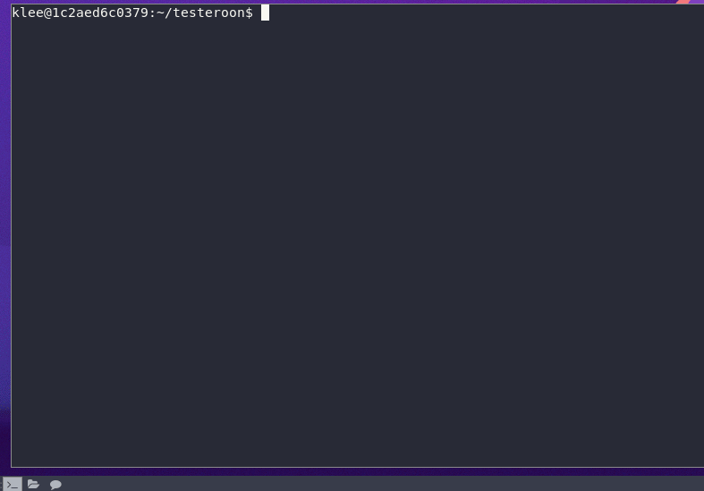

# klee-autogen-tests



You need to install [klee](https://klee.github.io/) (I ran it docker image) and [whole-program-llvm](https://github.com/travitch/whole-program-llvm)

Something like
```shell

docker pull klee/klee
sudo docker run -v /home/tal/dev/myprogram:/home/klee/testeroon --rm -ti --ulimit='stack=-1:-1' klee/klee
```
Also make sure to compile the program on the docker image to make sure the llvm versions will match (they must)

